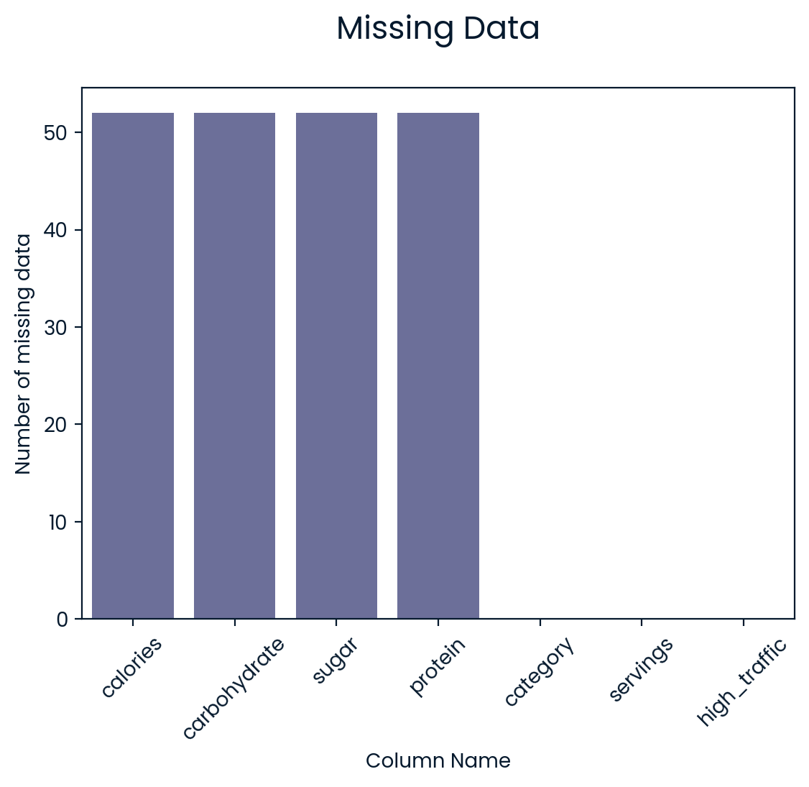

## Data Validation and Cleaning
## The dataset
This data set has 947 rows, 8 columns. I have validated all variables and some changes I've made after validation :
- Impute `calories`, `carbohydrate`, `sugar`, `protein` columns by median.
- Cleaning both `category` and `servings`.
- Fill missing data of `high_traffic` with 'Not High'.
- Covert the data type of `category`, `servings`, and `high_traffic` columns to categorical type.

| Column | Description |
|--------|-------------|
| `recipe` | 947 unique values without missing values, same as description. No cleaning.|
| `calories` |  Numeric values as described, containing 52 missing values. Cleaned using imputation.|
| `carbohydrate` |Numeric values as described, containing 52 missing values. Cleaned using imputation.|
| `sugar` | Numeric values as described, containing 52 missing values. Cleaned using imputation.|
| `protein` | Numeric values as described, containing 52 missing values. Cleaned using imputation.|
| `category` | Character values as described, "Chicken Breast" category was in the dataset, not as description. Cleaned by replacing "Chicken Breast" by "Chicken" then converted to categorical type|
| `servings` | Character values not as described due to "4 as a snack" and "6 as a snack" values, replace "4 as a snack" with 2 and "6 as a snack" with 4, then converted to categorical type|
| `high_traffic` | Character values with missing data represent 'Not High', fill missing data with 'Not High', then convert the column to categorical type|
### Cleaning & Validating `calories`, `carbohydrate`, `sugar` , and `protein` columns
- The `calories`, `carbohydrate`, `sugar`, and `protein` columns had 52 rows in common with missing data. After investigation, the missing values were imputed using the median due to high skewness (as discussed later in the Exploratory Analysis section) of their respective `category` type group.
- The columns contain outliers; however, due to their high percentage (above 5%), they do not indicate erroneous inputs, so I left them as they are.

### Cleaning & Validating `category` and `servings` colunms
- The `category` column does not match the information provided by the Head of Data Science, as it includes an additional category: 'Chicken Breast'. Therefore, I replaced it with just 'Chicken'.
- The `savings` column wasn't numerical as it contains ambiguous values: '4 as a snack' and '6 as a snack'. After investigation, I decided to replace the value '4 as a snack' with 2, meaning the recipe serves 2 for lunch, and '6 as a snack' was replaced with 4.
- The columns then converted to categorical type
## Exploratory Analysis
I investigated the target variable and the features of the recipes, as well as the relationships between the target variable and these features. After the analysis, I decided to apply the following changes to enable modeling:

- Remove the `servings` feature.
### Numeric Variables - `calories`, `carbohydrate`, `sugar`, and `protein`
The histograms and box plots of the numeric variables are shown below. As we can see from the histograms, all the variables are highly skewed to the right. Additionally, the box plots indicate that the variables contain values outside the IQR range. No action is needed.
#### Relationship between `calories`, `carbohydrate`, `sugar`, `protein` and `high_traffic`
Below is a heatmap of the relationships between the numerical features and `high_traffic`. The strongest relationship displayed is between `calories` and `protein` showing a positive low correlation.

### Categorical Variables - `category`, `servings`
- The recipe `category` types are slightly evenly distributed, with 'Chicken' having the largest proportion. Similarly, the `servings` feature shows that 4 servings represent 40%, a higher proportion compared to the others.

#### Relationship between `category`, `servings`, and `high_traffic`
Below is the relationship between the categorical variables and the target using a count plot. We can see that the `category` variable appears to have a relationship with `high_traffic`. On the other hand, the `servings` variable does not seem to show a relationship with the `high_traffic` variable. Therefore, a chi-square test for proportions was conducted between the `category` variable and `high_traffic`, as well as between `servings` and `high_traffic`. Based on the results, I decided to:
- Remove the `servings` feature during modeling, as the p-value was much greater than alpha.
- Retain the `category` feature, as it showed a significant relationship.

## Model Development
The buisness goal is to predict whether a recipe will bring a high traffic to the site or not when putting it in the home page, so this is a **binary classification problem**.   For this task I decided to chose the following models:
- **Logistic Regression (baseline):** A linear model that is known for its simplicity and interpretability, it performs well in binary classification problems and it is computationally efficient, making it a good candidate for quick training and evaluation. 
- **Support Vector Classifier (comparaison):** Chosen as comparaison model typically perform better with high-dimensional can be used with various kernel functions that allow it to create non-linear decision boundaries, which is good to capture non-linear relationships.
### Preparing data for modeling
To enable modeling, I chose `calories`, `carbohydrate`, `sugar`, `protein`, and `category` as features, `high_traffic` as target variables, the target variable already label encoded previously store in `high_traffic_enc` column. I also have made the following changes:

- The numeric features (i.e, `calories`, `carbohydrate`, `sugar`, and `protein`) was standardized using RobustScaler as they contain outliers.
- One-hot encoded the `category` variable.
- Split the data into a training set and a test set, with stratifying the target variable in both sets.
### Feature importance of Logistic regression model

## Model Evaluation
For evaluation, I chose precision as the primary metric for our KPI, with accuracy as a secondary metric for comparing the two models.
- As the business goal is to maximize website traffic, it is crucial to avoid promoting recipes that don’t perform well. High **precision** indicates a lower rate of false positives, meaning that when the model predicts a recipe will attract traffic, it is likely to do so. This approach ensures that we promote recipes that are expected to increase website traffic.
- **Accuracy** is an intuitive and straightforward metric that is easily understood by stakeholders. It provides a comprehensive view of the model's overall performance, making it a valuable secondary metric for evaluation. This is why **accuracy** was chosen as a secondary metric.
### Results
The Linear Regression Model achieved a precision of 83%, which means that it predicts a recipe will bring high traffic to the website 83% of the time. Its accuracy of 77% suggests that the overall predictions made by the model were correct.

In comparison, the Support Vector Classifier obtained a precision of 82% and an accuracy of 75%.

Both models performed well in terms of precision, with the Linear Regression Model showing slightly higher precision, making it better than the Support Vector Classifier in this regard. The same applies to accuracy, further establishing the Linear Regression Model as the superior choice compared to the Support Vector Classifier.
## Evaluate by Business Criteria
The business goal is to predict recipes that will bring high traffic to the site 80% of the time.

As discussed above, the Logistic Regression Model performs well in both precision and accuracy, achieving 83% and 77%, respectively, compared to the Support Vector Classifier, which meets the business requirement.  

The business should monitor precision as its primary KPI and accuracy as the secondary KPI to assess the overall performance of the model.
## Recommendations
To help the company predict which recipes are likely to bring traffic to the site, I recommend deploying the Logistic Regression model to automate the process. I will recommend the following steps to ensure the model can be deployed and improved regularly:
- Fully deploy the model using the best strategies.
- Collect more data, particularly on recipes that were not predicted to bring high traffic, to improve the model’s performance and make it more robust.
- Investigate and incorporate new features that may enhance the prediction process, such as user ratings.
- Regularly monitor the precision and accuracy of the model to ensure it continues to perform well and aligns with the company’s traffic goals.